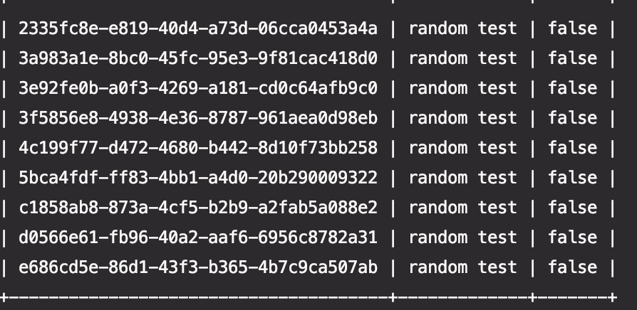

# todo-grpc

Simple TODO list for GRPC.  Just busy work, since I don't have any real project ideas right now, and I don't work with grpc on my current job.  So I wanted to kee my grpc chops strong


This is a simple client-server application.  It uses BadgerDB as a backend.   Unfortunately I found that BadgerDB workers like Cassandra in that it uses tombstones, and there aren't immediate deletes.  But oh well


This comes with a CLI, below are the commands


```bash
todo-client add --task-name="some task"
```

This will add a new task
 
```bash
todo-client add --task-file
```
This will add tasks coming from a todo_list.yml.  It's in this directory called todo_list.yml.  The file is big and I have mainly used it for stress testing


```bash
todo-client list --list-task=<id>
```

This will list a single task

```bash
todo-client list --list-all
```

Below is a sample of display




#How to compile

```bash
make all
```

This will stage the following files

|client|server|
-------|---------
|./bin/todo-client| ./bin/todo-server|
-------------


